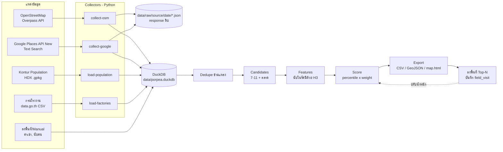

# Porpea: ออกแบบระบบคัดกรองทำเลร้านเปาะเปี๊ยะทอด (เริ่มที่ชลบุรี)

เป้าหมาย: ดึงข้อมูลจากหลายแหล่งมาให้คะแนน แล้วได้ **รายชื่อจุดที่ควรไปดูจริง (Top-N)** พร้อมแผนที่
ระบบนี้ไม่ได้ตัดสินแทน แต่ช่วยตัดจุดที่ไม่น่าสนใจออก เพื่อให้เวลาลงพื้นที่ไปกับจุดที่มีโอกาสสูง

---

## 1. ทำความเข้าใจสินค้าก่อนเลือก factor

เปาะเปี๊ยะทอดเป็น **ของกินเล่นราคาถูก ซื้อแบบไม่ได้วางแผน (impulse) ซื้อระหว่างทาง** ดังนั้นสิ่งที่สำคัญคือ:

| สิ่งที่ต้องการ | ความหมาย |
|---|---|
| คนเดินผ่านเยอะ (footfall) | ยิ่งคนผ่านเยอะ ยิ่งมีโอกาสขาย |
| คนผ่านแล้ว **หยุดได้** | จอดมอไซค์ได้ มีที่ยืนรอ ไม่ใช่ถนนที่รถวิ่งเร็ว |
| ช่วงเวลาตรงกับเวลาขาย | หลังเลิกเรียน 15:00–18:00, เลิกงาน/เลิกกะ, ตลาดเช้า/เย็น |
| กลุ่มลูกค้าตรง | นักเรียน นักศึกษา คนงานโรงงาน ครอบครัวที่มาจ่ายตลาด |
| คู่แข่งไม่หนาแน่นเกินไป | ร้านขายของเดียวกันในรัศมีเดินถึง |
| ต้นทุนพื้นที่ไหว | ค่าเช่าแผง/หน้าร้าน เทียบกับยอดขายที่คาด |

---

## 2. Factor ที่ใช้วิเคราะห์ (และหาข้อมูลจากไหน)

### 2.1 ความต้องการ / คนผ่าน (Demand & Traffic)

| Factor | ทำไมสำคัญ | แหล่งข้อมูล | วิธีดึง | เฟส |
|---|---|---|---|---|
| **จำนวน 7-11 รอบจุด** | 7-11 เลือกทำเลจากทราฟฟิก → ใช้เป็นตัวแทนคนผ่านได้ดี | Google Places, OSM | API / Overpass | 1 |
| **จำนวนรีวิวของร้านรอบๆ** (`userRatingCount`) | รีวิวเยอะ = คนเข้าเยอะ (proxy ของ footfall) | Google Places | API | 1 |
| ประชากรในรัศมี 500 ม./1 กม. | ฐานลูกค้าที่อยู่อาศัย | Kontur Population (H3 400ม.), WorldPop, Meta HRSL | ดาวน์โหลดไฟล์ HDX | 1 |
| ตลาดสด / ตลาดนัด / ตลาดโต้รุ่ง | จุดรวมคนซื้อของกิน | Google Places, OSM | API / Overpass | 1 |
| โรงเรียน / มหาวิทยาลัย | ลูกค้าหลังเลิกเรียน (ถ้าได้ **จำนวนนักเรียน** จะดีมาก) | OSM, data.go.th (ข้อมูลโรงเรียน สพฐ.) | Overpass / CSV | 1 (2 สำหรับจำนวนนักเรียน) |
| โรงงาน + **จำนวนคนงาน** | ชลบุรีมีนิคมฯ เยอะ (อมตะ, ปิ่นทอง, แหลมฉบัง) — ลูกค้าเลิกกะ | กรมโรงงานอุตสาหกรรม (data.go.th), OSM landuse=industrial | CSV / Overpass | 1 |
| หอพัก / อพาร์ทเม้นท์ | คนทำงาน/นักศึกษาอยู่หนาแน่น | OSM, Google Places | Overpass / API | 1 |
| ป้ายรถเมล์ / จุดจอดสองแถว / วิน | คนรอรถ = เวลาว่างซื้อของกิน | OSM | Overpass | 1 |
| โรงพยาบาล / หน่วยราชการ | คนเยอะช่วงกลางวัน | OSM | Overpass | 1 |
| ร้านอาหารรอบๆ (food cluster) | ย่านของกิน = คนตั้งใจมาซื้อของกิน | OSM, Google | Overpass / API | 1 |
| **ช่วงเวลาคนแน่น (Popular times)** | ตรงกับเวลาขายไหม | ไม่มีใน API ทางการ → Outscraper / SerpApi / BestTime (เสียเงิน) หรือนับเองหน้างาน | API เสียเงิน (เฉพาะ Top-N) | 2 |
| Mobile footfall | แม่นที่สุด | AIS/True/dtac business data (เสียเงิน, ต้องติดต่อ) | B2B | 3 |

### 2.2 การแข่งขัน (Competition)

| Factor | แหล่งข้อมูล | วิธีดึง | เฟส |
|---|---|---|---|
| ร้านเปาะเปี๊ยะ/ปอเปี๊ยะในรัศมี 100–300 ม. | Google Places (`เปาะเปี๊ยะทอด`), OSM (ชื่อร้าน) | API / Overpass | 1 |
| ระยะถึงคู่แข่งที่ใกล้ที่สุด | คำนวณจากข้างบน | — | 1 |
| ร้านขายของทอด/ของกินเล่นอื่น (ลูกชิ้นทอด ไก่ทอด) | Google Places | API | 2 |
| คู่แข่งบน LINE MAN / Grab / Wongnai | เช็คมือ (ToS ไม่อนุญาตให้ scrape) | Manual | 2 |

> ร้านเปาะเปี๊ยะส่วนใหญ่เป็นรถเข็น/แผงลอยที่ไม่อยู่บน Google Maps → ข้อมูลคู่แข่งจะ **ต่ำกว่าความจริง** เสมอ ต้องยืนยันตอนลงพื้นที่

### 2.3 ต้นทุนและความเป็นไปได้ (Cost & Feasibility)

| Factor | แหล่งข้อมูล | วิธีดึง | เฟส |
|---|---|---|---|
| ค่าเช่าหน้าร้าน/พื้นที่ | DDproperty, Livinginsider, Kaidee, FB Marketplace | Scrape (เช็ค robots.txt/ToS) หรือเก็บมือ | 2 |
| ค่าแผงในตลาด / ว่างไหม | กลุ่ม Facebook ตลาด, โทรถาม | Manual | 2 |
| พื้นที่หน้า 7-11 ให้เช่าไหม | ถามสาขา/เจ้าของที่ | Manual | ลงพื้นที่ |

### 2.4 การเข้าถึงและการมองเห็น (Access & Visibility) — ส่วนใหญ่ต้องดูหน้างาน

- ประเภทถนน (ถนนสายหลัก vs ซอย) → OSM `highway=*` (เฟส 2)
- จอดมอไซค์/รถได้ไหม, ฝั่งถนนขาเข้า-ขาออก (คนซื้อของกินมักซื้อ **ขากลับบ้าน**), มีร่มเงา, ใกล้ทางม้าลาย/สะพานลอย → **ลงพื้นที่/Street View**

### 2.5 กำลังซื้อ (Socio-economic) — เฟส 3

- รายได้เฉลี่ยครัวเรือนรายอำเภอ (สำนักงานสถิติแห่งชาติ NSO)
- จำนวนประชากรตามทะเบียนรายตำบล (กรมการปกครอง stat.bora.dopa.go.th) — ใช้ cross-check กับ Kontur

---

## 3. แนวคิดหลักของระบบ: "จุดผู้สมัคร" + "วงรัศมี"

แทนที่จะให้คะแนนทุกตารางเมตรของจังหวัด เราใช้ **จุดที่ร้านเปาะเปี๊ยะจะไปตั้งจริง** เป็นตัวตั้ง:

- **Candidate = 7-11 ทุกสาขา + ตลาดทุกแห่ง** ในชลบุรี (ปรับใน `candidates.anchor_categories`)
- รอบแต่ละจุด นับสิ่งต่างๆ ในรัศมี 300 ม. (เดินถึง), 500 ม., 1–2 กม. (ขี่มอไซค์มา)
- ใช้ **H3 hexagon resolution 9 (~0.1 ตร.กม.)** เป็น spatial index ให้นับรัศมีได้เร็ว และใช้เป็นหน่วยรวมข้อมูลประชากร



---

## 4. แหล่งข้อมูลและวิธีดึง (รายละเอียด)

### 4.1 OpenStreetMap ผ่าน Overpass API — ฟรี
- Endpoint: `https://overpass-api.de/api/interpreter` (POST, ไม่ต้องใช้ key)
- จำกัดพื้นที่ด้วยรหัสจังหวัด: `area["ISO3166-2"="TH-20"]->.a;` (TH-20 = ชลบุรี)
- ตัวอย่าง query (7-11):
  ```
  [out:json][timeout:180];
  area["ISO3166-2"="TH-20"]->.a;
  ( nwr["shop"="convenience"]["brand:wikidata"="Q259340"](area.a); );
  out center tags;
  ```
- ข้อดี: ฟรี ได้หมวดเยอะ (โรงเรียน ป้ายรถเมล์ หอพัก นิคมฯ) / ข้อเสีย: ความครบถ้วนในไทยไม่สม่ำเสมอ ไม่มีรีวิว
- query ทุกหมวดอยู่ใน `config/settings.yaml` → `osm.categories` (เพิ่ม/แก้ได้โดยไม่ต้องแตะโค้ด)
- ใช้อย่างสุภาพ: เว้น 5 วินาทีระหว่าง query, ดึงเดือนละครั้งพอ

### 4.2 Google Places API (New) — เสียเงิน แต่ครบที่สุดสำหรับ 7-11/ตลาด/คู่แข่ง
- Endpoint: `POST https://places.googleapis.com/v1/places:searchText`
- Header: `X-Goog-Api-Key`, `X-Goog-FieldMask: places.id,places.displayName,places.location,places.rating,places.userRatingCount,places.businessStatus,...`
- **ข้อจำกัด: ได้สูงสุด 60 ผลต่อ query** → ระบบแบ่งจังหวัดเป็นกริด 5 กม. ค้นทีละช่อง ถ้าช่องไหนได้ครบ 60 จะผ่าเป็น 4 ช่องย่อยแล้วค้นใหม่ (quadtree)
- **ประหยัดเงิน**: โหลดข้อมูลประชากรก่อน แล้วข้ามช่องที่ไม่มีคน (ทะเล/ป่า/สวน) — ชลบุรีจาก ~500 ช่อง เหลือราว 70–80 ช่อง
- ประเมินค่าใช้จ่าย: ใช้ `porpea collect-google --dry-run` ดูจำนวน request ก่อนยิงจริง
  การขอ `rating`/`userRatingCount` ทำให้คิดราคาที่ SKU ระดับ Enterprise — **ตรวจสอบราคาและโควต้าฟรีรายเดือนล่าสุดที่หน้า Google Maps Platform pricing ก่อนรัน**
  (ลำดับขนาดคร่าวๆ: ชลบุรีทั้งจังหวัด 3 query ≈ หลักร้อยถึงพันกว่า request ต่อรอบ)
- ข้อกำหนด Google: เก็บ `place_id` ได้ถาวร แต่ข้อมูลอื่น (ชื่อ, rating) ควร refresh เป็นระยะและไม่นำไปเผยแพร่ซ้ำ — ใช้วิเคราะห์ภายในเท่านั้น
- **ไม่แนะนำ** scrape หน้า Google Maps ตรงๆ (ผิด ToS, โดนบล็อก, ข้อมูลพังง่าย)

### 4.3 ประชากร — Kontur Population (ฟรี)
- HDX: ค้นหา "Kontur Population: Thailand" → ไฟล์ `.gpkg.gz` เป็นกริด H3 res 8 (~400 ม.) พร้อมจำนวนคน
- ระบบอ่านไฟล์ GeoPackage ได้เลย (เป็น SQLite) ไม่ต้องลง GDAL แล้วกรองเฉพาะ bbox ชลบุรี
- ทางเลือก: WorldPop (100 ม. raster), Meta High Resolution Population (HDX) → แปลงเป็น CSV `h3,population` แล้วโหลดได้เหมือนกัน

### 4.4 โรงงานและคนงาน — กรมโรงงานอุตสาหกรรม (ฟรี)
- data.go.th ค้นหา "โรงงาน" ของกรมโรงงานอุตสาหกรรม → CSV ที่มีพิกัดและจำนวนคนงาน
- ชื่อคอลัมน์แต่ละไฟล์ไม่เหมือนกัน → ระบุ mapping ตอนโหลด (ดู README)
- ใช้ `workers_2000` = ผลรวมคนงานในรัศมี 2 กม. (log scale)

### 4.5 แหล่งเสริม (เฟส 2–3)
- **Popular times**: Outscraper / SerpApi (Google Maps engine) / BestTime.app — เสียเงิน ใช้เฉพาะ Top-50 → ตาราง `popular_times`
- **ค่าเช่า**: DDproperty / Livinginsider — เช็ค robots.txt ก่อน scrape, หรือให้คนเก็บใส่ Google Sheet แล้ว import → ตาราง `rent_listing`
- **จำนวนนักเรียนรายโรงเรียน**: ข้อมูล สพฐ./data.go.th → แทน `n_school_500` ด้วย `students_500`
- **ขอบเขตอำเภอ/ตำบล**: HDX "Thailand - Subnational Administrative Boundaries" → ใช้สรุปคะแนนรายตำบล

---

## 5. โครงสร้างข้อมูล (DuckDB)

เลือก **DuckDB** เพราะเป็นไฟล์เดียว ไม่ต้องตั้ง server, query SQL ได้, ต่อกับ pandas ตรงๆ
(ถ้าในอนาคตมีหลายคนใช้พร้อมกัน/ทำหลายจังหวัด ย้ายไป PostgreSQL + PostGIS ได้ เพราะ schema เป็น SQL ธรรมดา)

Schema เต็มอยู่ที่ [`src/porpea/schema.sql`](../src/porpea/schema.sql)

| ตาราง | 1 แถว = | คอลัมน์สำคัญ |
|---|---|---|
| `poi` | จุดสนใจ 1 จุด ต่อ 1 หมวด ต่อ 1 แหล่ง | `poi_uid` (`source:category:id`), `category`, `lat/lon`, `h3_r9`, `rating_count`, `status`, `extra` (JSON ดิบ) |
| `population_hex` | กริด H3 1 ช่อง | `h3`, `res`, `population`, `source` |
| `factory` | โรงงาน 1 แห่ง | `lat/lon`, `workers`, `industry` |
| `rent_listing` | ประกาศเช่า 1 รายการ | `price_thb_month`, `area_sqm`, `listing_type` |
| `popular_times` | ความแน่นราย ชม. ของ POI | `poi_uid`, `dow`, `hour`, `busyness` |
| `candidate` | จุดผู้สมัคร 1 จุด | `anchor_poi_uid`, `anchor_category`, `lat/lon` |
| `candidate_feature` | ค่า feature 1 ตัว ของ 1 จุด (long format) | `candidate_id`, `feature`, `value` |
| `score_run` | การให้คะแนน 1 ครั้ง | `run_id`, `config` (น้ำหนักที่ใช้) |
| `candidate_score` | คะแนนของ 1 จุดใน 1 run | `score` 0–100, `rank`, `breakdown` (JSON), `flags` |
| `field_visit` | การลงพื้นที่ 1 ครั้ง | `foot_traffic_15min`, `rent_quote_thb`, `verdict` |
| `fetch_log` | การดึงข้อมูล 1 ครั้ง | `source`, `query`, `n_items`, `raw_path` |

โครงสร้างไฟล์:
```
config/settings.yaml          ← พื้นที่, query, features, น้ำหนัก (แก้ตรงนี้เป็นหลัก)
src/porpea/
  collectors/osm.py           ← Overpass
  collectors/google_places.py ← Google Places (tiling + quadtree)
  collectors/population.py    ← Kontur gpkg / CSV
  collectors/factories.py     ← CSV กรมโรงงาน
  analysis.py                 ← dedupe, candidates, features, score
  export.py                   ← CSV / GeoJSON / map.html
  schema.sql
data/raw/<source>/<YYYYMMDD>/*.json   ← response ดิบ (ไม่ commit)
data/porpea.duckdb                    ← ฐานข้อมูล (ไม่ commit)
data/out/<run_id>/                    ← ผลลัพธ์แต่ละรอบ
```

**ทำไมเก็บ response ดิบ**: ถ้าแก้วิธี parse หรือเพิ่ม field ทีหลัง ประมวลผลใหม่จากไฟล์ได้เลย ไม่ต้องเสียเงินยิง API ซ้ำ

---

## 6. Pipeline การวิเคราะห์

1. **Dedupe ข้ามแหล่ง** — 7-11 สาขาเดียวกันอาจมาจากทั้ง Google และ OSM → ถ้าหมวดเดียวกันห่างกัน ≤ 40 ม. เก็บแหล่งที่น่าเชื่อกว่า (`source_priority: [google, osm]`) และตัดร้านที่ `CLOSED_PERMANENTLY` ทิ้ง
2. **Candidates** — 7-11 + ตลาด ที่เหลือหลัง dedupe
3. **Features** (กำหนดใน config ไม่ต้องแก้โค้ด) — ประเภทที่รองรับ:
   - `count` นับจุดหมวดที่กำหนดในรัศมี (ไม่นับตัวเอง)
   - `sum` รวมค่า field เช่น `rating_count` ในรัศมี
   - `nearest` ระยะถึงจุดที่ใกล้สุด (มีเพดาน)
   - `population` ผลรวมประชากรในรัศมี
   - `factory_workers` ผลรวมคนงานในรัศมี
   - `anchor` ค่าของจุดตั้งต้นเอง เช่น รีวิวของ 7-11 สาขานั้น
   - `transform: log1p` สำหรับค่าที่เบ้มาก (รีวิว, คนงาน)
4. **Score**
   - แปลงทุก feature เป็น **percentile 0–1 ภายในจังหวัด** (ทนต่อค่าโดดและหน่วยต่างกัน)
   - คูณน้ำหนัก (ลบ = เป็นผลเสีย เช่นคู่แข่ง) แล้วสเกลเป็น 0–100
   - `breakdown` เก็บว่าแต่ละ feature ให้คะแนนเท่าไหร่ → อธิบายได้ว่าทำไมจุดนี้ติดอันดับ
   - `flags` เตือน เช่น `competitor_close` (มีคู่แข่งใน 100 ม.), `low_population`
5. **Export** — `top_candidates.csv` (import เข้า **Google My Maps** ได้ทันทีเพื่อวางแผนเส้นทางลงพื้นที่), `.geojson` (เปิดใน kepler.gl/QGIS), `map.html` (แผนที่คลิกดูคะแนนย่อยได้)

### น้ำหนักเริ่มต้น (สมมติฐาน — ปรับตามผลลงพื้นที่)

| กลุ่ม | Feature | น้ำหนัก |
|---|---|---|
| คนอยู่อาศัย | pop_500, pop_1000 | 0.15, 0.05 |
| ทราฟฟิก | n_711_500, reviews_500, anchor_reviews | 0.10, 0.10, 0.10 |
| แม่เหล็กดึงคน | n_market_500, n_school_500, workers_2000 | 0.10, 0.10, 0.10 |
| อื่นๆ | busstop, dorm, food, univ, hospital | 0.02–0.05 |
| คู่แข่ง | n_competitor_300 (−), dist_competitor (+) | −0.15, 0.05 |

---

## 7. ลงพื้นที่และปิด loop (สำคัญที่สุด)

คะแนนจาก desk research เป็นแค่ตัวกรอง ต้อง validate:

1. เอา Top 20–30 ไปลงพื้นที่ **2 ช่วงเวลา** (เช่น 15:30–16:30 หลังเลิกเรียน และ 17:30–18:30 เลิกงาน)
2. นับคนเดินผ่าน 15 นาที, ดูที่จอดรถ, ฝั่งถนน, ร้านคู่แข่งที่ไม่อยู่บน Google, ถามค่าเช่า
3. บันทึกลงตาราง `field_visit` (หรือ Google Form → CSV → import)
4. เมื่อมีข้อมูล 30+ จุด: ดู correlation ระหว่าง feature กับ `foot_traffic_15min` → ปรับ `weights` หรือ fit linear regression ง่ายๆ แทนการกำหนดน้ำหนักเอง
5. ถ้าเปิดร้าน/ลองขายจริงแล้ว: ยอดขายต่อวันคือ label ที่ดีที่สุดสำหรับปรับโมเดลในสาขาถัดไป

---

## 8. Automation

- รันทั้งหมดด้วย CLI: `collect-osm → load-population → load-factories → collect-google → analyze`
- ตั้งเวลา **เดือนละครั้ง** (cron หรือ GitHub Actions + เก็บ API key ใน Secrets) — ข้อมูลพวกนี้ไม่ได้เปลี่ยนเร็ว
- ขยายจังหวัด: copy `settings.yaml` แก้ `iso3166_2` + `bbox` (เช่น ระยอง TH-21) แล้วชี้ `--config`

## 9. Roadmap

| เฟส | งาน |
|---|---|
| **1 (ทำแล้วในโค้ดนี้)** | OSM, Google Places, Kontur, กรมโรงงาน → candidates → features → score → CSV/แผนที่ |
| 2 | Popular times (Top-N), ค่าเช่า, จำนวนนักเรียน, ประเภทถนนจาก OSM, Dashboard (Streamlit) ปรับน้ำหนักแบบ slider |
| 3 | ข้อมูล mobile footfall, กำลังซื้อรายอำเภอ, โมเดลทำนายยอดขายจากผลลงพื้นที่/สาขาจริง |

## 10. ข้อควรระวัง

- **ToS/กฎหมาย**: ใช้ API ทางการเป็นหลัก, เคารพ robots.txt, ไม่ scrape แอปเดลิเวอรี่/Google Maps หน้าเว็บ, ไม่เก็บข้อมูลส่วนบุคคล (PDPA)
- **Bias ของข้อมูล**: แผงลอยและตลาดนัดชั่วคราวไม่ค่อยอยู่บนแผนที่ → คู่แข่งและตลาดนัดถูกนับต่ำกว่าจริง
- **7-11 หนาแน่น ≠ ดีเสมอ**: ในเมืองพัทยาอาจเป็นกลุ่มนักท่องเที่ยว ที่อาจไม่ใช่ลูกค้าหลักของเปาะเปี๊ยะ → ดู breakdown ประกอบ
